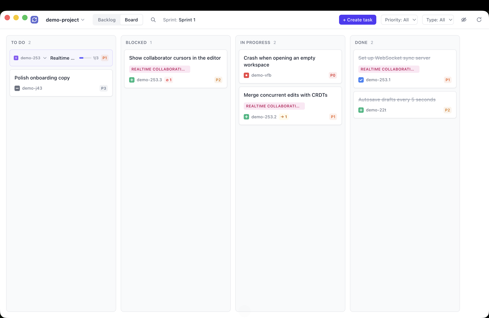
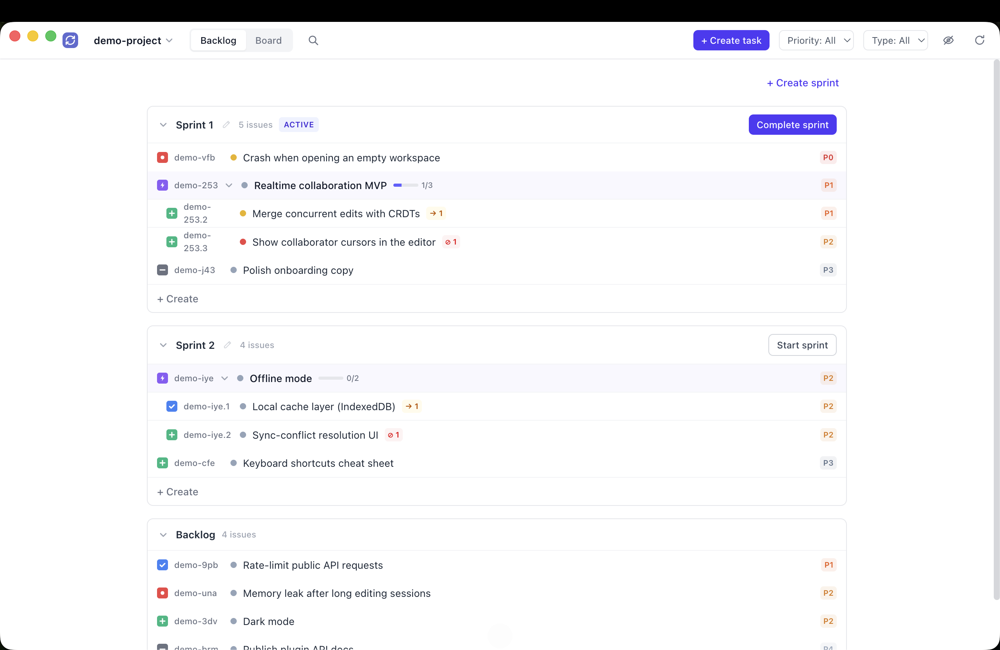
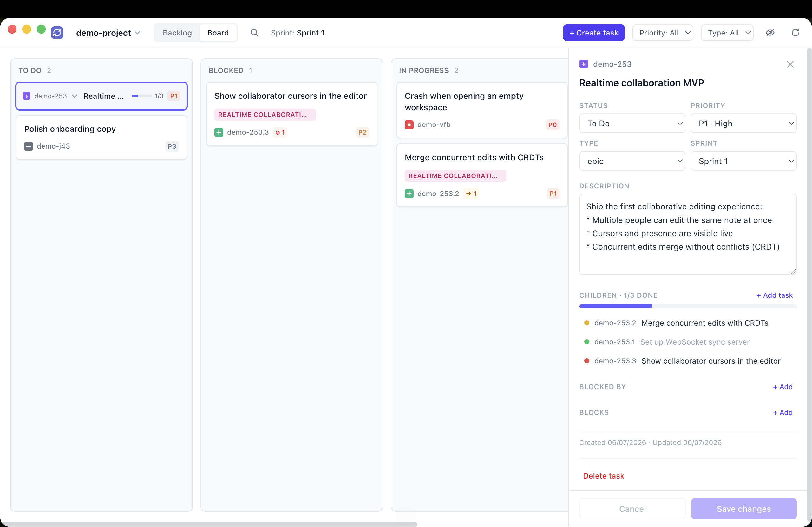
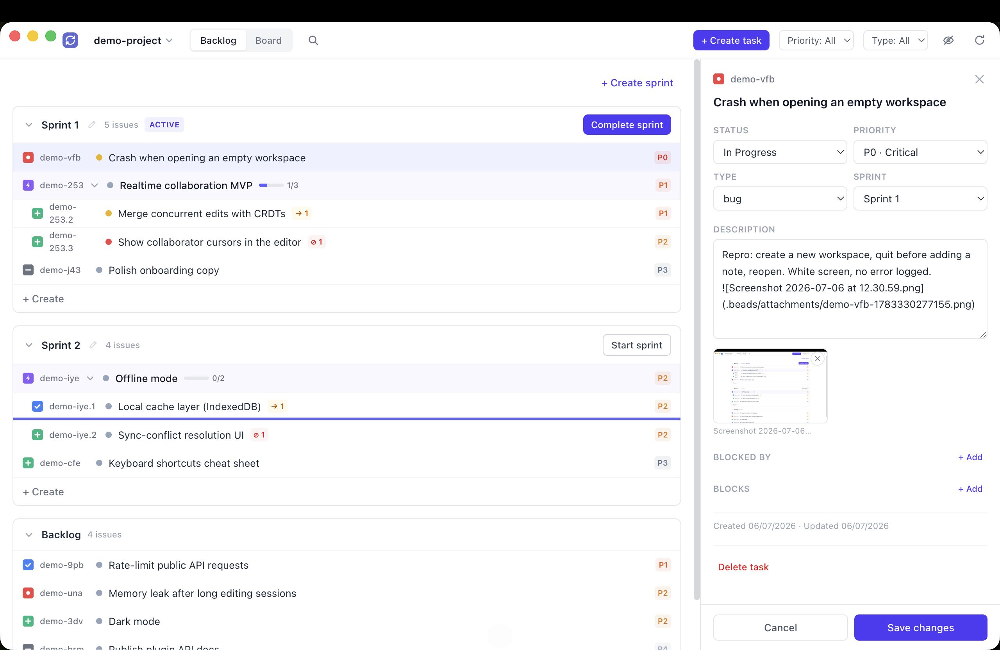
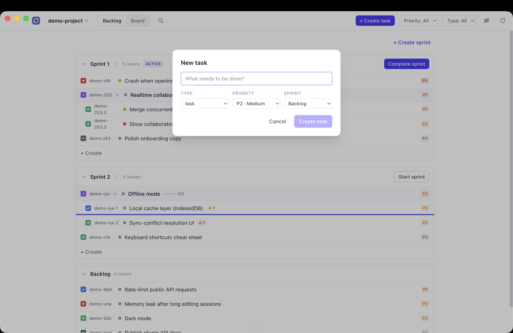

# Beads Sprints

A macOS kanban board with sprints for [beads](https://github.com/steveyegge/beads) (`bd`) projects. Sprints are plain `sprint:*` labels, so agents and the `bd` CLI see them too.

<p align="center">
  
</p>
<p align="center">
  
  
</p>
<p align="center">
  
  
</p>

## Download

Grab the app from [Releases](https://github.com/cris7ea/beads-sprints/releases), unzip, and drag it to Applications.

The app is unsigned, so on first launch: right-click the app → Open.

## Requirements

- macOS (Apple Silicon)
- [bd](https://github.com/steveyegge/beads) installed and on your PATH

## Using with Claude Code (or other agents)

Sprints are just labels, so agents can follow them too. Add this to your project's `CLAUDE.md` so sessions keep new work in the active sprint:

```markdown
- **Sprints:** at the start of each task, read the active sprint (`activeSprint` for this project) with `cat "/Users/<you>/Library/Application Support/beads-sprints/settings.json"`. Sprint labels use the format `sprint:<name>` (e.g. `sprint:Sprint 1`). The rule: **any task I'm actively working on must carry the active sprint label.** Concretely:
  - `bd create` → add `-l "sprint:<active>"` (unless I explicitly say it's backlog — then label it `backlog` instead).
  - Starting work on an existing task that has `backlog` or an old sprint label → move it into the active sprint (`bd label add <id> "sprint:<active>"`, remove `backlog`/old sprint label) before claiming.
  - Work discovered mid-task: label with the active sprint only if it will be done now; otherwise label `backlog`.
  - Never label a task with a sprint that isn't the active one.
```

Replace `/Users/<you>` with your home directory or just tell your agent to help (if needed).

Add `.beads/attachments` to your `.gitignore` if you won't want to commit/track image attachments.

## Run from source

```sh
npm install
npm start
```

## Build the mac app

```sh
npm run make-mac-app
```

The app lands in `release/mac-arm64/`.
